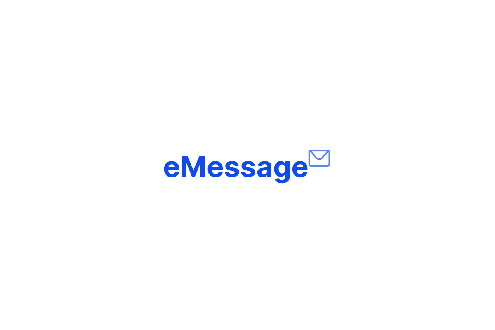

# eMessage - API

## ⚠Em desenvolvimento

Atualmente este projeto está em desenvolvimento.

## 📑Objetivo da aplicação

Esta aplicação é responsável por cordenar troca de mensagens entre clientes por meio do prolotocolo WebSocket.

## Mostre seu apoio

Dê uma ⭐ se esse projeto te ajudou!